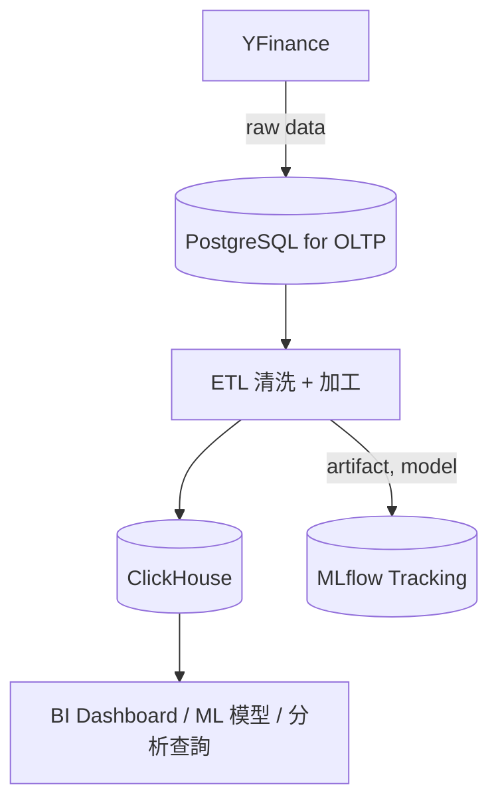

# TODO list
- 定時任務
- 按時間分區（RANGE by date）
- 暫時只能在container 跑 ETL

```mermaid
graph TD
    yf[YFinance]
    yf -->|raw data| OLTP_DB[(PostgreSQL for OLTP)]
    OLTP_DB --> ETL_Process[ETL 清洗 + 加工]
    ETL_Process --> OLAP_DB[(ClickHouse)]
    ETL_Process -->|artifact, model| MLflow[(MLflow Tracking)]
    OLAP_DB --> BI_Tool[BI Dashboard / ML 模型 / 分析查詢]

```
