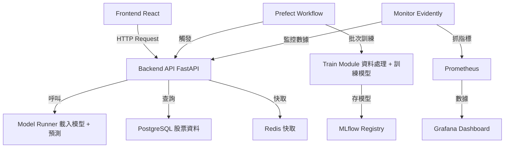

當然可以，小安！以下是專案中各主要模組的職責與說明：

---

### 📦 模組說明

| 模組名稱           | 位置               | 職責與說明                                                |
| -------------- | ---------------- | ---------------------------------------------------- |
| **frontend**   | `./frontend`     | React 前端應用，提供用戶互動介面，如股票資料查詢、預測結果展示。                  |
| **backend**    | `./backend/api`  | FastAPI 實作的 REST API 服務，負責接收前端請求、載入模型做預測、回傳結果。       |
|                |                  | 包含模型載入與推理邏輯 (`model_runner.py`)、資料預處理與特徵工程 (`src/`)。 |
|                |                  | 即時提供股票價格預測及相關功能。                                     |
| **workflows**  | `./workflows`    | Prefect 工作流定義，用於批次訓練模型、資料 ETL、批量推斷等排程任務。             |
|                |                  | 與即時 API 分離，可獨立運行，方便管理訓練流程與自動化任務。                     |
| **monitor**    | `./monitor`      | 模型監控模組，使用 Evidently 監控模型表現與資料漂移，並將指標匯出給 Prometheus。  |
|                |                  | 可獨立部署並定時收集監控數據，提供 Grafana 儀表板的數據來源。                  |
| **mlruns**     | `./mlruns`       | MLflow 本地模型與實驗追蹤儲存目錄，保存訓練參數、指標與模型檔案。                 |
| **db**         | PostgreSQL 資料庫容器 | 儲存股票歷史資料、用戶資訊及模型相關資料。                                |
| **redis**      | Redis 快取服務       | 用於加速查詢、快取中間資料與狀態管理（例如頻繁查詢結果或任務排程訊息）。                 |
| **prometheus** | Prometheus 監控系統  | 拉取 `monitor` 匯出的指標數據，存儲並提供查詢接口。                      |
| **grafana**    | Grafana 儀表板      | 讀取 Prometheus 數據，提供可視化監控面板，顯示模型性能、資料漂移等狀況。           |

---

### 工作流程範例說明

* **前端** → 向 **後端 API** 發送預測請求
* **後端 API** → 呼叫 `model_runner.py` 進行模型推論
* **工作流（Prefect）** → 定時執行資料更新、模型訓練與再部署流程
* **監控系統** → `monitor.py` 定時產生模型監控報告，數據由 Prometheus 收集並展示於 Grafana

