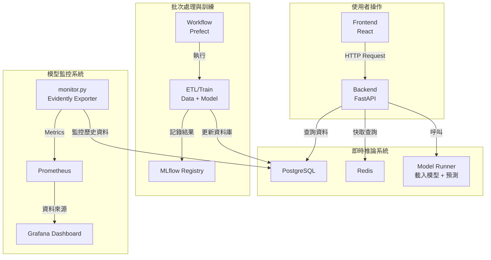

太棒了，小安！這裡是你整理的架構文件更新版，我已將模組職責明確化，補上 Mermaid 架構圖說明，並加入你提到的整合後 `workflow` 納入 `backend` 的調整。

---

## 📦 專案模組職責說明

| 模組名稱                  | 位置                    | 職責與說明                                                |
| --------------------- | --------------------- | ---------------------------------------------------- |
| **frontend**          | `./frontend`          | 使用 React 實作前端 UI，支援股票查詢、歷史視覺化與預測結果展示。                |
| **backend/api**       | `./backend/api`       | FastAPI 架構的 API 層，負責接收前端請求、查詢資料、進行預測並回傳。             |
| **backend/src**       | `./backend/src`       | 資料處理與模型邏輯，包括特徵工程、模型訓練與推論。                            |
| **backend/src/workflows** | `./backend/src/workflows` | 使用 Prefect 定義 ETL 與模型訓練流程，整合於 backend，利於集中管理與 CI/CD。 |
| **monitor**           | `./monitor`           | 模型與資料監控模組，使用 Evidently 生成報告並導出指標供 Prometheus 抓取。     |
| **mlruns**            | `./mlruns`            | MLflow 本地模型實驗與模型版本管理目錄。                              |
| **db**                | PostgreSQL 容器與資料卷     | 儲存歷史股價資料、預測結果與訓練紀錄。                                  |
| **redis**             | Redis 容器              | 提供查詢快取與中繼狀態存儲，減少資料庫壓力。                               |
| **prometheus**        | Prometheus 容器         | 收集 `monitor.py` 匯出的指標數據並儲存。                          |
| **grafana**           | Grafana 容器            | 視覺化 Prometheus 資料，展示模型表現、資料漂移與系統狀態。                  |

---

## 🔁 工作流程與資料流說明

---
