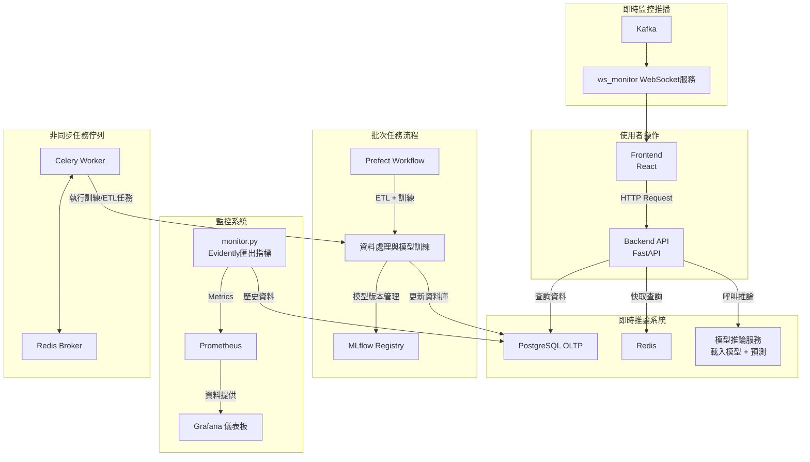

太棒了，小安！這裡是你整理的架構文件更新版，我已將模組職責明確化，補上 Mermaid 架構圖說明，並加入你提到的整合後 `workflow` 納入 `backend` 的調整。

---

## 📦 專案模組職責說明

| 模組名稱                      | 目錄位置                      | 職責說明                                                    |
| ------------------------- | ------------------------- | ------------------------------------------------------- |
| **frontend**              | `./frontend`              | React 前端，負責股票查詢、歷史資料視覺化、模型預測結果展示、操作介面。                  |
| **backend/api**           | `./backend/api`           | FastAPI API 層，處理前端請求、路由分發、資料 CRUD、推論 API 等。             |
| **backend/src**           | `./backend/src`           | 核心商業邏輯：特徵工程、模型訓練、推論邏輯、資料管理。                             |
| **backend/src/workflows** | `./backend/src/workflows` | 使用 Prefect 定義的批次 ETL 與訓練流程，統一納入 backend，便於 CI/CD 與版本控管。 |
| **monitor**               | `./monitor`               | 模型監控及資料品質管理，使用 Evidently 產生報告，並暴露 Prometheus 指標供監控系統抓取。 |
| **mlruns**                | `./mlruns`                | MLflow 本地模型實驗與模型版本管理資料存放目錄。                             |
| **db**                    | `./db` (PostgreSQL 資料卷)   | PostgreSQL OLTP 與模型元資料存放。                               |
| **redis**                 | Redis 容器                  | 快取層與訊息中繼，減少 DB 負載，提高系統響應速度。                             |
| **prometheus**            | Prometheus 容器             | 收集與儲存監控指標資料。                                            |
| **grafana**               | Grafana 容器                | 指標資料視覺化展示，呈現模型表現、資料漂移及系統狀態。                             |
| **kafka**                 | Kafka 容器                  | 事件訊息串流平台，用於即時資料與監控訊息傳遞。                                 |
| **ws\_monitor**           | `./ws_monitor`            | WebSocket 即時監控服務，整合 Kafka 消息並提供前端推播。                    |
| **celery**                | Celery 任務佇列               | 背景非同步任務處理，如訓練、ETL 等長時間任務。                               |
| **minio**                 | MinIO 容器                  | 物件存儲服務，作為 MLflow artifact repository。                   |

---

## 🔁 工作流程與資料流說明

---
