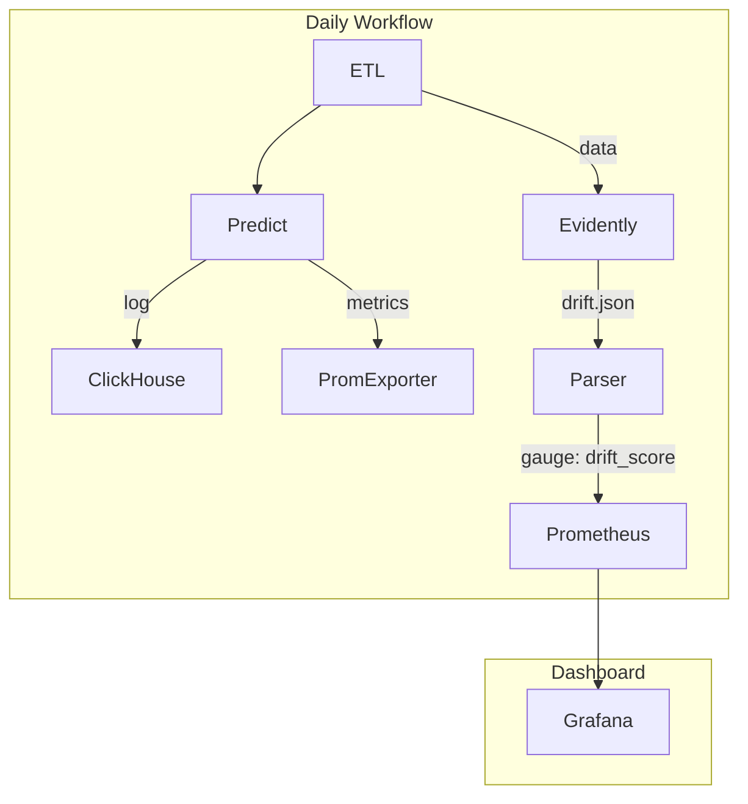

| 任務類型           | 工具         | 實作方式                                             |
| -------------- | ---------- | ------------------------------------------------ |
| ❗ 異常偵測         | Evidently  | 定期（或即時）產出異常報告（HTML/JSON），並提供告警通知或上傳至 S3 等儲存空間    |
| 🔎 特徵與預測分佈監控   | Evidently  | 持續監控特徵與預測分佈，產生報告，並可將關鍵指標匯出給 Prometheus 或其他系統整合   |
| 📊 即時數據監控      | Prometheus | 在預測服務（API）內建指標（計數器、延遲、錯誤率等），透過 Prometheus 即時抓取監控 |
| 🧪 實驗紀錄與模型版本管理 | MLflow     | 管理模型版本與訓練實驗記錄，追蹤模型參數、指標與元資料，方便回溯與復現              |

---

### 1. Evidently

* **主要功能**：專注於 **機器學習模型的監控與資料質量分析**。
* **用途**：

  * 監控模型預測的品質與效能（例如準確率、AUC、誤差等指標）。
  * 偵測資料漂移（Data Drift）與概念漂移（Concept Drift），也就是輸入資料分布或目標分布的變化。
  * 監控特徵分布、特徵重要性變化。
  * 生成報告和視覺化面板，協助團隊了解模型在真實環境中的表現。
* **使用場景**：

  * 監控模型在生產環境中是否因資料變化而效能下降。
  * 對模型做持續監控與定期評估，發現問題提前告警。
* **技術面**：

  * 一般會透過定期批次資料或即時資料輸入 Evidently，計算相關統計指標。
  * 可輸出報告、或整合到 dashboard 供展示。

---

### 2. Prometheus

* **主要功能**：**系統與應用程式監控與告警工具**，是現代 DevOps 非常常用的監控系統。
* **用途**：

  * 監控機器資源使用（CPU、記憶體、磁碟、網路流量等）。
  * 監控服務的可用性、響應時間、錯誤率等運行時指標（metrics）。
  * 支援即時數據抓取（pull model），適合實時監控與告警。
* **使用場景**：

  * 監控整個服務架構的健康狀況。
  * 在 MLOps 中，監控模型服務的 CPU、記憶體使用，API 回應時間與錯誤率。
  * 作為基礎設施和應用程式性能監控系統。
* **技術面**：

  * 透過 Exporter 抓取服務端 metrics。
  * 配合 Alertmanager 實現告警通知。

---

### 總結比較：

| 面向   | Evidently          | Prometheus          |
| ---- | ------------------ | ------------------- |
| 監控對象 | ML 模型性能、資料質量、資料漂移  | 系統資源、應用服務的運行狀態與指標   |
| 監控內容 | 模型準確率、分布漂移、特徵重要性等  | CPU、記憶體、響應時間、錯誤率等   |
| 告警功能 | 支援（模型異常或資料漂移）      | 支援（系統異常、資源異常等）      |
| 運作模式 | 一般為批次分析或定時分析       | 即時抓取監控數據            |
| 適用場景 | 專注 ML 模型在生產環境的品質監控 | 基礎設施與應用層面的性能與健康狀態監控 |

---

如果你在 MLOps pipeline 裡面：

* **Prometheus** 是監控 ML 服務本身的「運行狀態」。
* **Evidently** 是監控模型「智慧決策」品質和資料本身狀態。

---

有需要我也可以幫你整理一些範例或架構圖，幫助你更清楚兩者搭配使用的設計！
