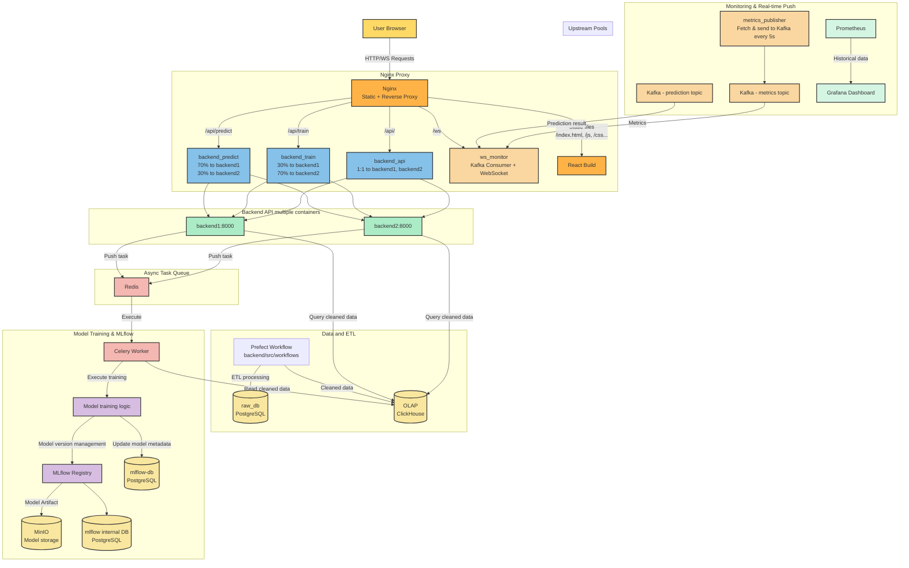
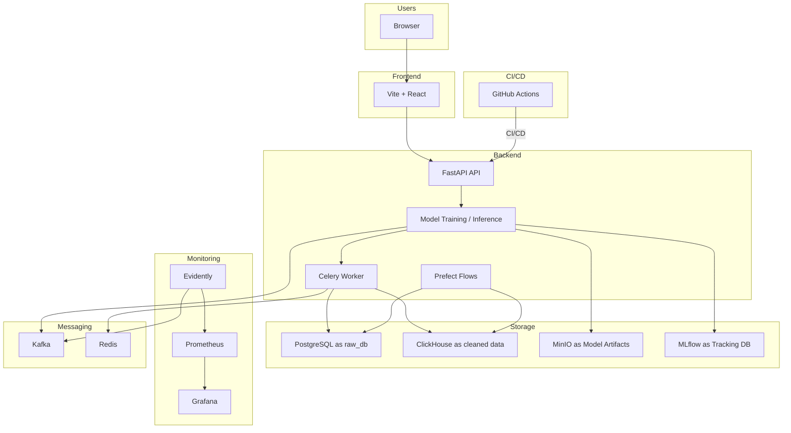

# Stock Price Prediction with MLOps


[繁體中文版](./readme_zh.md)
## 🎯 Course Project

### Objective

The goal of this project is to apply everything learned in the course to build an end-to-end machine learning system with full MLOps workflow.

---

## 📍 Problem Statement

This project aims to build a sustainable and maintainable stock price prediction system, implementing the complete MLOps lifecycle including data collection, feature engineering, model training, experiment tracking, real-time inference, deployment, and monitoring.

Users can query predicted stock prices and historical trend charts through a web interface. Developers can periodically retrain models, track experiments, monitor performance and data drift, and trigger auto-retraining.

---

## 🧰 Technologies Used

| Category                   | Tools & Frameworks                                                |
| -------------------------- | ----------------------------------------------------------------- |
| **Cloud / Infra**          | Docker Compose (extendable to EC2), MinIO, PostgreSQL, ClickHouse |
| **ML Pipeline**            | FastAPI, Scikit-learn, Pandas, MLflow                             |
| **Workflow Orchestration** | Prefect 2                                                         |
| **Monitoring**             | Evidently + Prometheus + Grafana                                  |
| **CI/CD**                  | GitHub Actions                                                    |
| **Testing**                | pytest (unit + integration tests)                                 |
| **Formatting / Hooks**     | black, pre-commit, flake8                                         |
| **IaC**                    | Docker Compose + Volume + Network (extendable to Terraform)       |

---

## 🏗️ Project Structure

```
.
├── backend/                  # Backend with API, ML logic, workflows
│   ├── api/                  # FastAPI routes (train, predict)
│   ├── src/                  # Feature engineering, model training/inference
│   ├── monitor/              # Monitoring logic using Evidently
│   ├── tasks/                # Celery async tasks
│   ├── workflows/            # Prefect ETL & training flows
│   └── tests/                # Unit & integration tests
├── frontend/                 # Frontend (Vite + React)
├── data/, db/, pgdata/       # Data and DB initialization folders
├── monitor/                  # Prometheus & Grafana configurations
├── Dockerfile.*, docker-compose.yml
├── Makefile, setup.md, implementation_log.md
├── .github/                  # GitHub Actions configuration
│   └── workflows/            # GitHub Actions CI/CD workflow
├── .pre-commit-config.yaml   # Pre-commit configuration
├── README.md
```

---

## 🔁 Model Lifecycle

1. ETL and training pipelines are triggered regularly via Prefect
2. Training results are logged to MLflow and registered as versioned models
3. FastAPI serves `/predict` and `/train` APIs (Celery-supported)
4. Evidently exports model drift metrics to Prometheus
5. Grafana dashboards visualize prediction accuracy, drift metrics, and system metrics

---

## 🖥️ System Architecture (Mermaid)



- Visual diagram of the Docker Compose services


---

## 📈 Evaluation Checklist

### ✅ Problem Definition

* ✔️ Well-defined scope: stock prediction + model lifecycle

### ☁️ Infrastructure

* ✔️ Docker Compose setup with multiple services
* ✔️ IaC-friendly (MinIO, DB volumes, Prometheus)

### 🔬 Experiment Tracking

* ✔️ MLflow for logging experiments and model versioning
  - [here](backend/src/model_training/train.py)

### 📅 Workflow Orchestration

* ✔️ Prefect 2 for ETL and training flows
   - [here](./backend/workflows/etl_core.py)

### 🚀 Model Deployment

* ✔️ FastAPI for model inference (containerized API)

### 📊 Monitoring

* ✔️ Evidently + Prometheus + Grafana for data/model monitoring
    - [docker-compose.monitor.yml](./docker-compose.monitor.yml)
    - [docker-compose.kafka.yml](./docker-compose.kafka.yml)

* [Webhook to discord](./.github/workflows/cd-deploy.yml)

### 🔁 Reproducibility

* ✔️ Makefile + setup.md + requirements + Docker for consistent setup
    ```
    make dev-setup
    ```

### 🧪 Best Practices

* [x] Unit tests
    - [train unit test code](./backend/tests/test_train.py)
    - [predict unit test code](./backend/tests/test_predict.py)
* [x] Integration tests
    - [predict api test code](backend/integraton-test/test_predict_api.py)
    - [train api test code](backend/integraton-test/test_train_api.py)
* [x] Code formatting (black, flake8)
    - [refer to pre-commit-config.yaml](.pre-commit-config.yaml)
* [x] Makefile automation
    - [refer to Makefile](./Makefile)
* [x] Pre-commit hooks
    - [refer to pre-commit-config.yaml](.pre-commit-config.yaml)
* [x] GitHub Actions for CI
    - [refer to .github/workflows/ci-tests.yml](.github/workflows/ci-tests.yml)
    - [refer to .github/workflows/cd-deploy.yml](.github/workflows/cd-deploy.yml)

---

## ⚙️ Installation Guide

```bash
# Create virtual environment
python -m venv .venv
source .venv/bin/activate
pip install -r backend/requirements.txt

# Start all services
docker compose up --build

# Run Prefect workflow or one-off training
make train
make workflow
```

---

## 📊 Dataset

Historical stock data from TW & US markets (e.g., 2330.TW, AAPL, TSM):

* Source: Yahoo Finance
* Transformed via ETL and stored in Parquet format (see `workflows/parquet/`)

---

## 🔗 Useful Resources

* [MLFlow Documentation](https://mlflow.org/)
* [Evidently AI Docs](https://docs.evidentlyai.com/)
* [Prefect 2 Docs](https://docs.prefect.io/)
* [Grafana Dashboards](https://grafana.com/grafana/dashboards)

---

## 📜 License

MIT License.
