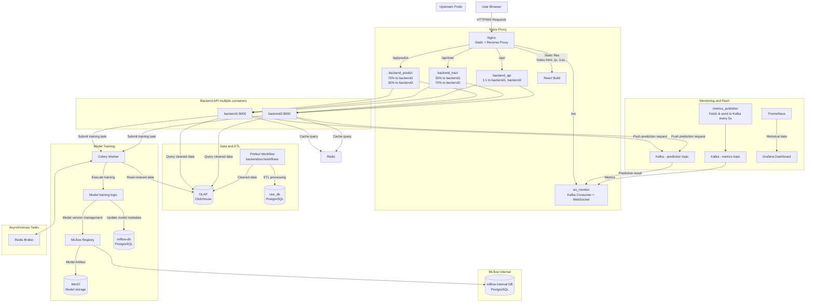
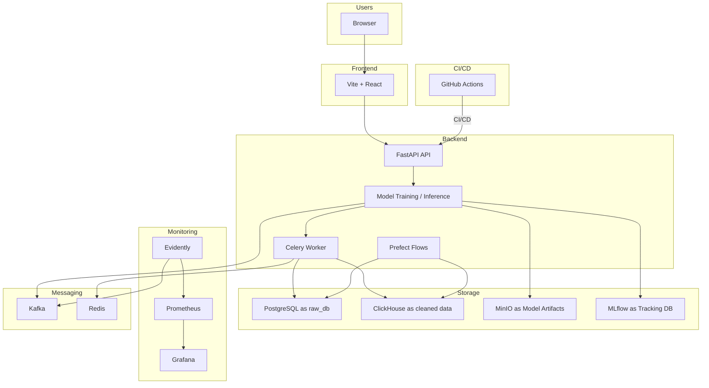

# Stock Price Prediction with MLOps

[English](./readme.md)

## 🎯 Course Project

### Objective

The goal of this project is to apply everything we have learned in this course to build an end-to-end machine learning project.

---

## 🧩 Problem Statement

本專案旨在建立一個可持續維運的股票預測系統，實作完整的 MLOps 工作流程，包含資料收集、特徵工程、模型訓練、實驗追蹤、即時預測、部署與監控。

使用者可以透過網頁查詢特定股票的預測價格與歷史趨勢圖；開發者則能定期訓練新模型、追蹤實驗、監控模型效能與資料漂移，並觸發自動 retraining。

---

## 🚀 Technologies Used

| 類別                    | 工具與框架                                                     |
|-----------------------|-------------------------------------------------------------|
| **Cloud / Infra**     | Docker Compose（可延伸至 EC2）、MinIO、PostgreSQL、ClickHouse |
| **ML Pipeline**       | FastAPI, Scikit-learn, Pandas, MLflow                        |
| **Workflow Orchestration** | Prefect 2                                                  |
| **Monitoring**        | Evidently + Prometheus + Grafana                             |
| **CI/CD**             | GitHub Actions                                               |
| **Testing**           | pytest（單元 + 整合測試）                                     |
| **Formatting / Hooks**| black, pre-commit, flake8                                    |
| **IaC**               | Docker Compose + Volume + Network（可擴充至 Terraform）        |

---

## 🏗️ Project Structure

```

.
├── backend/                  # Backend with API, ML logic, workflows
│   ├── api/                  # FastAPI routes (train, predict)
│   ├── src/                  # Feature engineering, model training/inference
│   ├── monitor/              # Monitor via Evidently
│   ├── tasks/                # Celery tasks for async training
│   ├── workflows/            # Prefect ETL & Training pipelines
│   └── tests/                # Unit & integration tests
├── frontend/                 # React 前端介面（Vite + React）
├── data/, db/                # 資料夾與資料庫初始化
├── monitor/                  # Prometheus & Grafana 設定
├── Dockerfile.\*, docker-compose.yml
├── Makefile, setup.md, 實作歷程.md
├── README.md

```

---

## 🧪 Model Lifecycle

1. 使用 Prefect 定期觸發 ETL 與訓練流程
2. 訓練結果紀錄至 MLflow，並註冊模型版本
3. FastAPI 提供 `/predict` 與 `/train` API（支援 Celery 任務）
4. 使用 Evidently 將模型 drift 指標輸出給 Prometheus
5. Grafana Dashboard 顯示預測表現、資料漂移指標、系統指標等

---

## 🖥️ System Architecture (Mermaid)

- Visual diagram of the Docker Compose services

---

## 📈 Evaluation Checklist

### ✅ Problem Description

* ✔️ 項目明確定義：股票預測 + 模型管理

### ☁️ Cloud / Infrastructure

* ✔️ 使用 Docker Compose 管理多服務
* ✔️ 可延伸部署至雲端 + IaC（已實作 MinIO, DB volume, Prometheus）

### 📊 Experiment Tracking

* ✔️ 使用 MLflow 實驗紀錄 + 模型註冊

### 🔁 Workflow Orchestration

* ✔️ Prefect 2 實作 ETL 與訓練流程

### 🚢 Model Deployment

* ✔️ 使用 FastAPI 提供預測 API，並容器化部署

### 📡 Monitoring

* ✔️ Evidently + Prometheus + Grafana 組合進行資料/模型監控

### 🔁 Reproducibility

* ✔️ 完整的執行指令：Makefile + setup.md + requirements + Docker

### 🧰 Best Practices

* [x] Unit tests
* [x] Integration tests
* [x] Code formatter & Linter（black, flake8）
* [x] Makefile
* [x] Pre-commit hooks
* [x] GitHub Actions for CI

---

## 📦 Installation Guide

```bash
# 建立虛擬環境
python -m venv .venv
source .venv/bin/activate
pip install -r backend/requirements.txt

# 啟動所有服務
docker compose up --build

# 啟動 Prefect flow 或單次訓練
make train
make workflow
```

---

## 🔍 Dataset

使用台股與美股歷史資料（例如：2330.TW、AAPL、TSM）：

* 擷取來源：Yahoo Finance
* 經過 ETL 處理後儲存為 Parquet（見 workflows/parquet）

---

## 🔗 Useful Resources

* [MLFlow Docs](https://mlflow.org/)
* [Evidently Docs](https://docs.evidentlyai.com/)
* [Prefect 2](https://docs.prefect.io/)
* [Grafana Dashboards](https://grafana.com/grafana/dashboards)

---

## 📜 License

MIT License.

```
